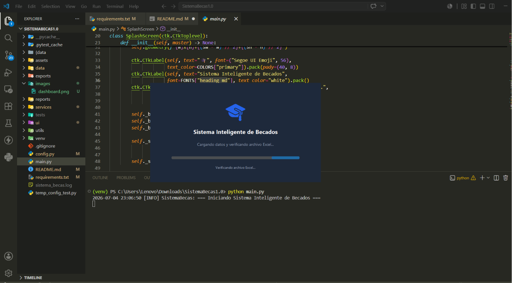
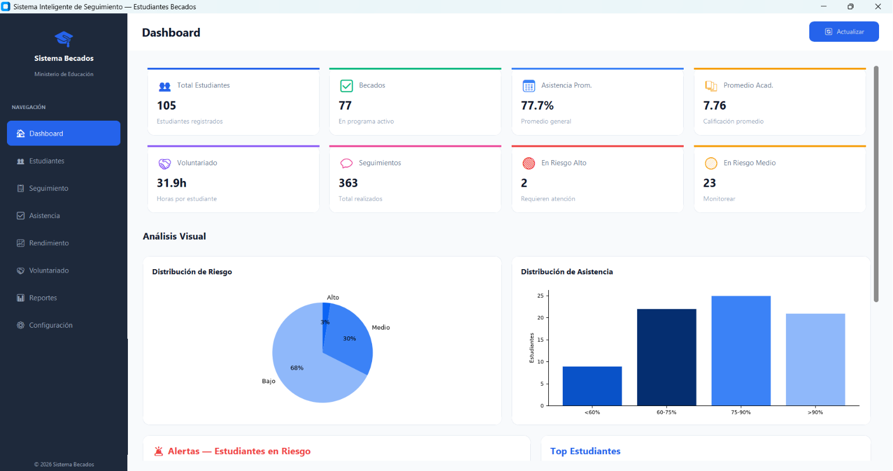
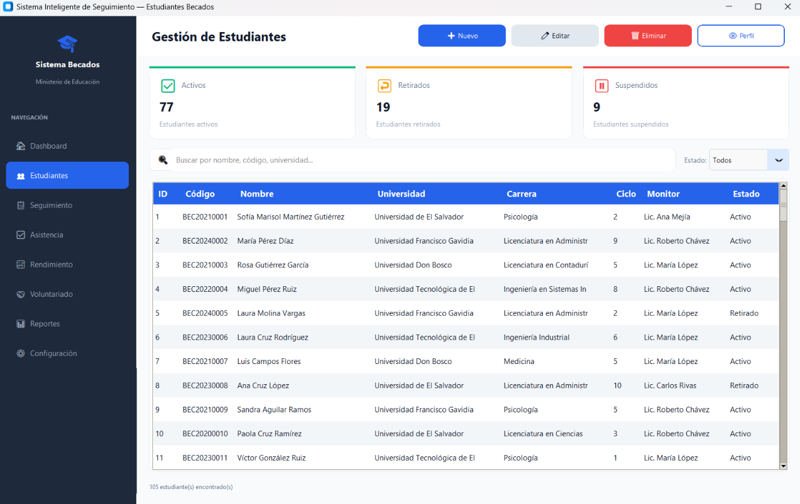
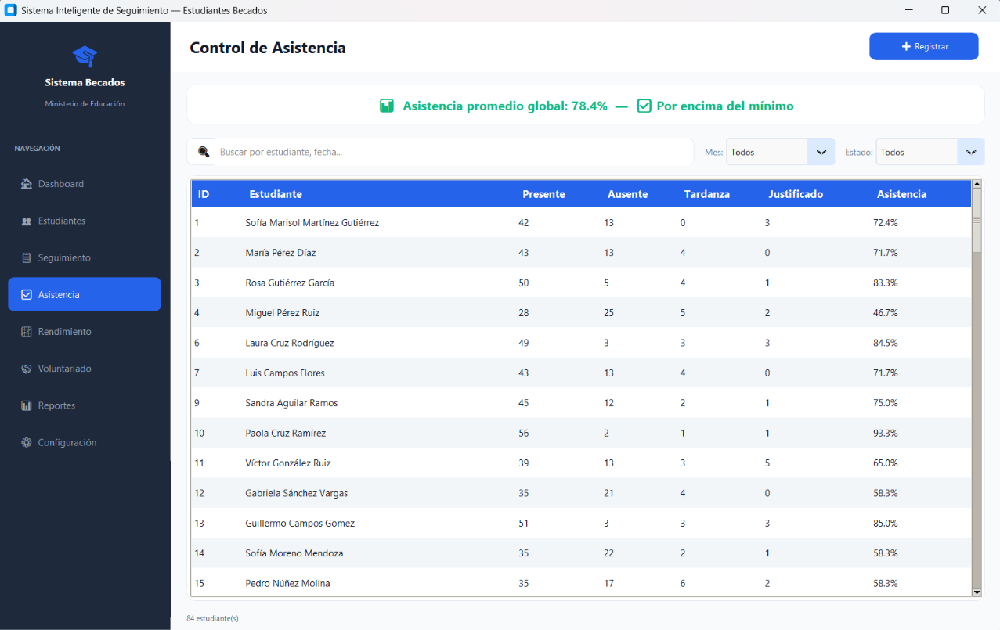
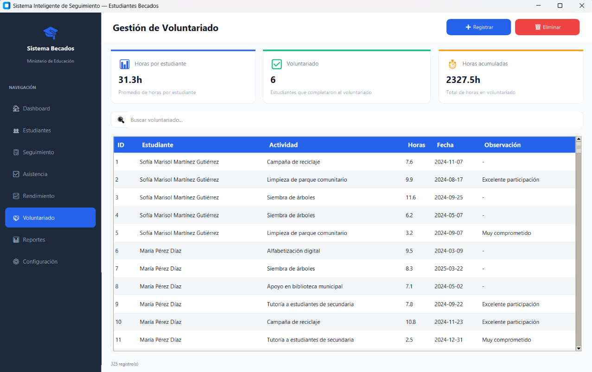
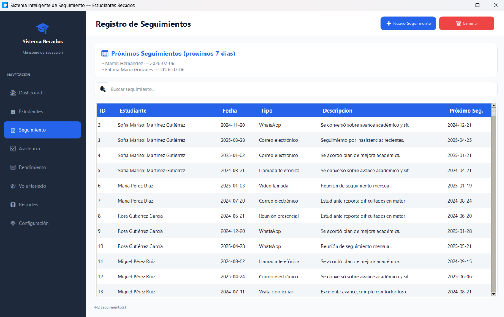
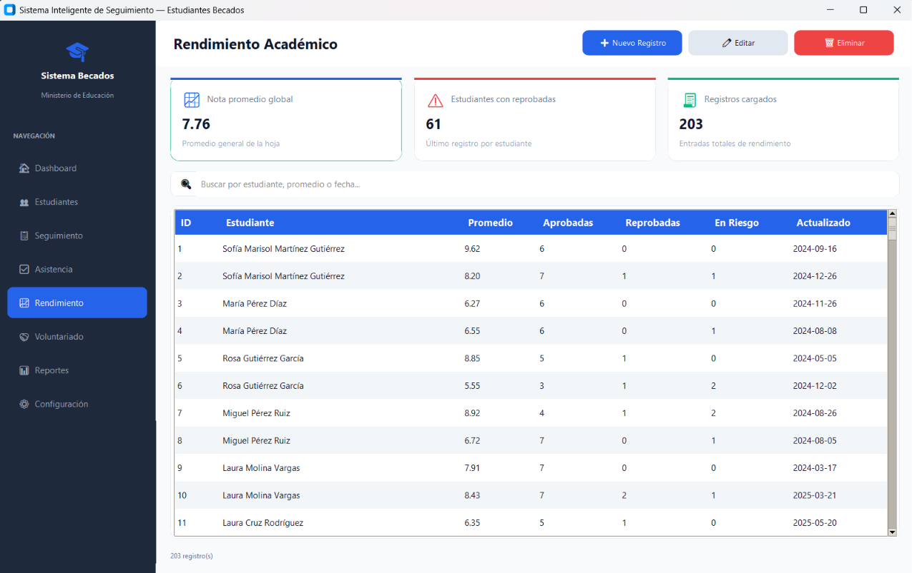
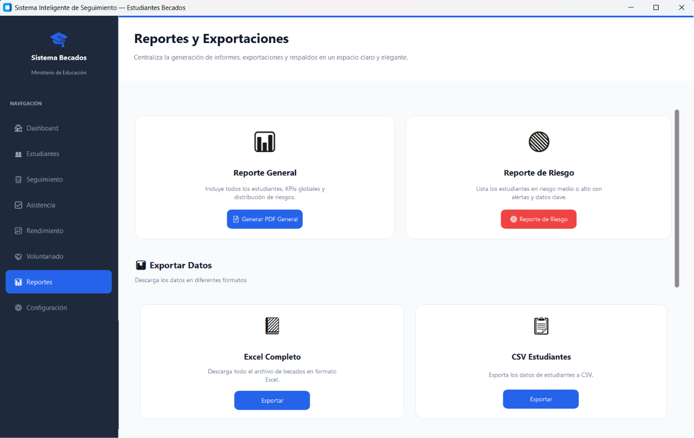
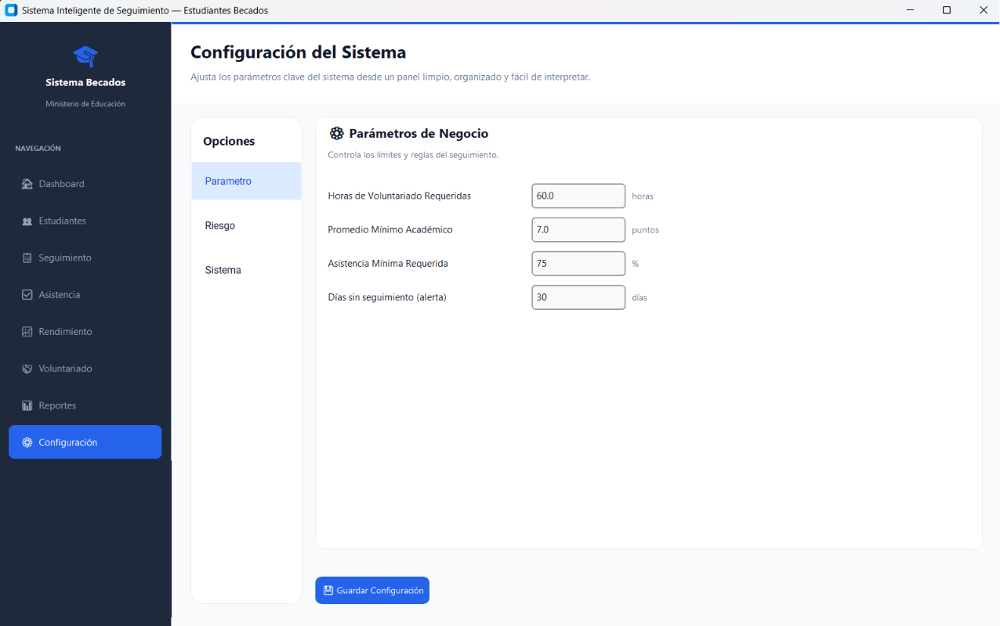
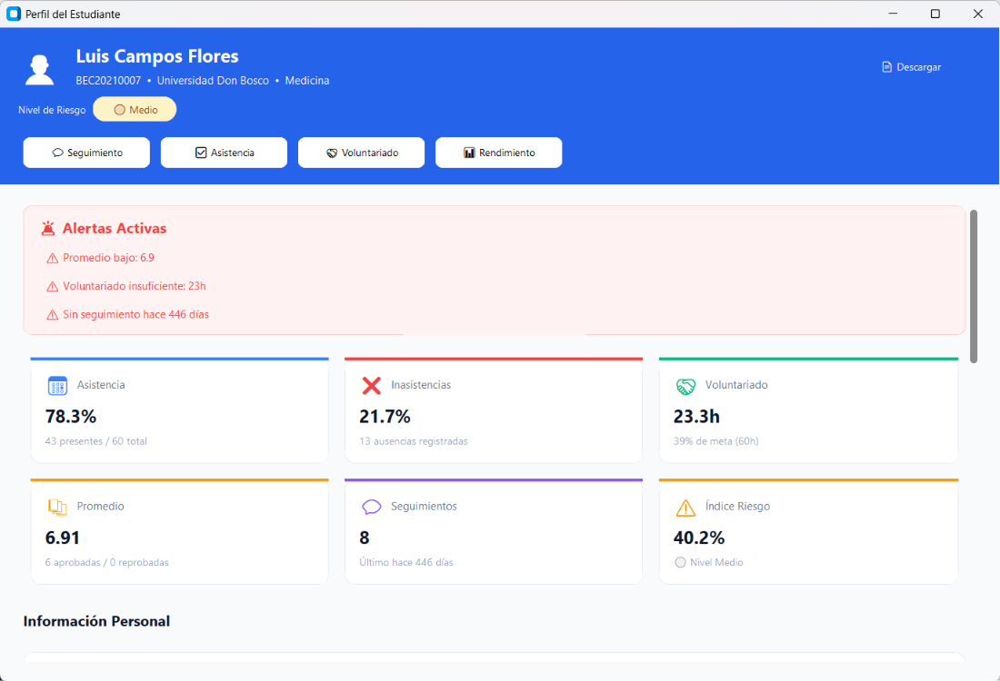

# 🎓 Sistema Inteligente de Seguimiento para Estudiantes Becados

Este proyecto implementa una aplicación de escritorio en Python para registrar, analizar y acompañar a estudiantes becados a través de una base de datos en Excel y una interfaz gráfica moderna construida con CustomTkinter.

La idea central es que el sistema funcione como una herramienta operativa para monitores, coordinadores o equipos de apoyo: permite mantener el estado académico y de seguimiento de cada estudiante, identificar riesgo y generar reportes de forma rápida.

<p align="center">
    
</p>

---

## ✨ Qué hace el sistema

La aplicación está organizada para cubrir los siguientes flujos:

- Dashboard general con KPIs y resumen de riesgo.
- Gestión de estudiantes: crear, editar, buscar y filtrar.
- Registro de asistencia diaria con métricas de participación.
- Registro de voluntariado y horas acumuladas.
- Seguimiento de contactos y próximos compromisos.
- Evaluación de rendimiento académico.
- Generación de reportes PDF individuales y generales.
- Configuración central de parámetros del negocio.

---

## 🧭 Flujo general de uso

1. Se inicia la aplicación desde main.py.
2. El sistema valida si el archivo Excel principal existe y, si está vacío, genera datos de prueba.
3. La interfaz carga las vistas del menú lateral y muestra el dashboard por defecto.
4. Cada módulo consulta o actualiza la información almacenada en las hojas del archivo Excel.
5. Los cambios se persisten mediante el gestor central de Excel y pueden exportarse o reportarse.

---

## 🏗 Arquitectura del proyecto

El código sigue una arquitectura sencilla en capas para facilitar el mantenimiento:

- Capa de entrada: main.py y ui/app.py
  - Inician la aplicación, muestran la pantalla de carga y montan la interfaz principal.
- Capa de interfaz: ui/
  - Contiene las vistas de cada módulo: dashboard, estudiantes, asistencia, seguimiento, rendimiento, voluntariado y reportes.
- Capa de negocio: services/
  - Implementa la lógica de validación, cálculo de indicadores y reglas del dominio.
- Capa de persistencia: services/excel_manager.py
  - Es el punto único de acceso al archivo Excel.
- Capa de datos: data/
  - Incluye datos de ejemplo, utilidades de generación y plantillas.

Esta separación permite modificar la interfaz sin afectar la lógica de negocio, o cambiar la fuente de datos sin reescribir toda la aplicación.

---

## 🛠 Tecnologías

- **Python 3.12+**
- **CustomTkinter** — Interfaz de escritorio moderna
- **Pandas + NumPy** — Manipulación de datos
- **OpenPyXL** — Lectura/escritura del archivo Excel
- **Matplotlib** — Gráficos embebidos en la aplicación
- **ReportLab** — Generación de reportes PDF

---

## 🔧 Herramientas y componentes clave

### 1. ExcelManager
Ubicado en services/excel_manager.py.

Es el componente central del sistema. Responsable de:

- Crear el archivo Excel si no existe.
- Garantizar la existencia de las hojas esperadas.
- Leer y escribir registros.
- Asignar IDs automáticos.
- Crear backups automáticos.
- Mantener caché de lectura para mejorar el rendimiento.

Este módulo es el único punto de acceso a los datos; por esa razón, cualquier cambio en la persistencia debería hacerse aquí o a través de los servicios que lo utilizan.

### 2. Servicios de negocio
En services/ se agrupan las reglas de cada dominio:

- estudiantes.py: CRUD de estudiantes, filtros y estadísticas básicas.
- asistencia.py: registro de asistencias, cálculo de porcentaje y días consecutivos sin asistencia.
- seguimiento.py: historial de seguimientos, alertas por falta de seguimiento y próximos seguimientos.
- voluntariado.py: registro de horas y cumplimiento de metas.
- rendimiento.py: gestión de promedios y rendimiento académico.
- indicadores.py: cálculo del índice de riesgo compuesto por asistencia, rendimiento, voluntariado y seguimiento.
- reportes.py: generación de reportes PDF profesionales.

### 3. Interfaz gráfica
En ui/ se definen las pantallas y componentes visuales. La clase App en ui/app.py orquesta la navegación entre vistas y habilita el overlay de carga mientras se procesan datos.

### 4. Configuración central
En config.py se concentran:

- Rutas del proyecto.
- Nombres de hojas del Excel.
- Columnas esperadas por hoja.
- Parámetros del negocio como horas de voluntariado requeridas, promedio mínimo, porcentaje mínimo de asistencia y umbrales de riesgo.
- Colores, tipografías y dimensiones de la ventana.

### 5. Logger y trazabilidad
En utils/logger.py se centraliza el registro de eventos y errores. Esto facilita el seguimiento de operaciones críticas y el diagnóstico de problemas.

---

## 📊 Algoritmo de riesgo

El sistema calcula un índice de riesgo para cada estudiante a partir de cuatro dimensiones:

| Dimensión | Peso | Qué evalúa |
|---|---:|---|
| Asistencia | 40% | Porcentaje de asistencia registrado |
| Promedio académico | 30% | Promedio sobre 10 |
| Voluntariado | 20% | Horas acumuladas frente a la meta |
| Seguimiento | 10% | Días desde el último seguimiento |

La clasificación es:

- Bajo: índice de riesgo menor o igual a 0.40
- Medio: entre 0.40 y 0.70
- Alto: mayor a 0.70

Este cálculo se implementa en services/indicadores.py y alimenta el dashboard y los reportes.

---

## 🗂 Estructura del archivo Excel

El sistema usa un archivo Excel como base de datos principal. El archivo generado se encuentra en data/becados.xlsx y contiene estas hojas:

- Estudiantes: datos personales, académicos y estado del estudiante.
- Asistencias: registro diario de presencia o ausencia.
- Voluntariado: actividades y horas registradas.
- Seguimientos: historial de seguimiento y acciones tomadas.
- Rendimiento: promedios y materias aprobadas/reprobadas.

Cada hoja sigue un esquema definido en config.py y es gestionada por ExcelManager.

---

## 📄 Reportes disponibles

- **Reporte individual**: PDF completo por estudiante
- **Reporte general**: Resumen global de todos los estudiantes
- **Reporte de riesgo**: Lista de estudiantes en riesgo medio o alto
- **Backups**: Realiza un backup del exel original
- **Exportacion de datos**: Exporta los registros de asistencia, estudiantes o seguimientos en un formato CSV
- **Exportar exel**: Descarga todo el archivo de becados en formato Excel

---

## 📁 Estructura del proyecto

```text
├── main.py
├── config.py
├── requirements.txt
├── README.md
├── assets/
├── data/
│   ├── carreras_universidades.py
│   ├── generar_datos.py
│   ├── plantillas/
│   ├── backups/
│   └── becados.xlsx
├── exports/
├── images/
├── reports/
├── services/
│   ├── excel_manager.py
│   ├── estudiantes.py
│   ├── asistencia.py
│   ├── seguimiento.py
│   ├── voluntariado.py
│   ├── rendimiento.py
│   ├── indicadores.py
│   └── reportes.py
├── ui/
│   ├── app.py
│   ├── menu.py
│   ├── dashboard.py
│   ├── estudiantes.py
│   ├── seguimiento.py
│   ├── asistencia.py
│   ├── rendimiento.py
│   ├── voluntariado.py
│   ├── perfil.py
│   ├── reportes_view.py
│   ├── config_view.py
│   └── components/
│       └── cards.py
└── utils/
    └── logger.py
```

---

## 🚀 Instalación y ejecución

### Requisitos

- Python 3.10 o superior
- pip actualizado

### Pasos

#### 1. Clonar o descomprimir el proyecto

Clona el repositorio:

```bash
git clone https://github.com/EliasO23/sistema_seguimiento_becas.git
```

O bien, descomprime el archivo ZIP del proyecto.

#### 2. Abrir la carpeta del proyecto

```powershell
cd <ruta-del-proyecto>
```

#### 3. Crear entorno virtual

Abra una terminal de **PowerShell** y ejecute:

```powershell
python -m venv .venv
```
## 4. Activar el entorno virtual

```powershell
.\.venv\Scripts\Activate.ps1
```

> **Nota:** Si aparece el siguiente mensaje:
>
> ```text
> File ...\Activate.ps1 cannot be loaded because running scripts is disabled on this system.
> ```
>
> Ejecute primero el siguiente comando en la misma ventana de PowerShell:
>
> ```powershell
> Set-ExecutionPolicy -Scope Process -ExecutionPolicy Bypass
> ```
>
> Si PowerShell solicita confirmación, escriba **A** (o **S**, según el idioma del sistema) y presione **Enter**. Luego vuelva a ejecutar:
>
> ```powershell
> .\.venv\Scripts\Activate.ps1
> ```

#### 5. Instalar dependencias

```powershell
pip install -r requirements.txt
```

#### 6. Ejecutar la aplicación

```powershell
python main.py
```

### Comportamiento inicial

Al iniciar por primera vez:

- Se verifica la existencia de data/becados.xlsx.
- Si el archivo no existe o está vacío, se generan datos de prueba.
- La interfaz se abre con un dashboard listo para usar.

---

## 🛠 Cómo extender el proyecto

Si se quiere continuar desarrollando el sistema, los puntos más naturales para trabajar son:

1. Agregar nuevas vistas en ui/
   - Por ejemplo una sección de pagos, becas adicionales o seguimiento clínico.

2. Crear nuevos servicios en services/
   - Para encapsular reglas de negocio específicas.

3. Ampliar el modelo de datos en config.py y en las hojas del Excel
   - Si se agregan nuevas columnas o módulos, conviene mantener consistencia entre configuración y gestor Excel.

4. Reutilizar ExcelManager
   - Evitar acceder directamente a pandas o openpyxl desde las vistas.

5. Mantener la lógica de reportes en reportes.py
   - Si se necesitan nuevos reportes, conviene extender este servicio en vez de generar PDF directamente desde las vistas.

---

## 🔒 Buenas prácticas implementadas

- Arquitectura en capas: UI ↔ Services ↔ Excel
- Código con **type hints** y separación de responsabilidades
- Logging de eventos y errores en `sistema_becas.log`
- Backups automáticos antes de escrituras en Excel
- Caché de lectura para mejorar rendimiento
- Operaciones de inicialización en hilo para no bloquear la UI
- Validaciones y manejo de errores para Excel en uso

---

## 📝 Notas de mantenimiento

- El archivo Excel se crea y mantiene automáticamente.
- Los reportes PDF se almacenan en reports/.
- Las exportaciones quedan en exports/.
- Los backups se guardan en data/backups/.
- Los parámetros del sistema deben modificarse desde config.py y no desde cada vista individual.

---

## ✅ Resumen ejecutivo

Este proyecto combina una interfaz agradable, reglas de negocio claras y un modelo de almacenamiento simple basado en Excel para convertirse en una herramienta práctica de seguimiento. Su estructura actual permite evolucionar sin perder trazabilidad y sin depender de una base de datos compleja en las primeras etapas del desarrollo.

---

## ✨ Anexos

### - **Reportes**

📘 [Reporte Individual](reports/reporte_7_20260704_233638.pdf)

📘 [Reporte General](reports/reporte_general_20260704_203348.pdf)

📙 [Reporte de Riesgo](reports/reporte_riesgo_20260704_203351.pdf)

---

### - **Dashboard**
<p align="left">
    
</p>

### - **Gestión de estudiantes**
<p align="left">
    
</p>

### - **Registro de asistencia**
<p align="left">
    
</p>

### - **Registro de voluntariado**
<p align="left">
    
</p>

### - **Registro de seguimientos**
<p align="left">
    
</p>

### - **Rendimiento académico**
<p align="left">
    
</p>

### - **Generación de reportes**
<p align="left">
    
</p>

### - **Configuración**
<p align="left">
    
</p>

### - **Perfil de estudiante**
<p align="left">
    
</p>

---
